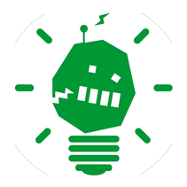

<!doctype html>
<html>
<head>
<meta charset="utf-8">
<title>Documento sin título</title>

</head>

<BODY BGCOLOR="#02F500">

&nbsp;

&nbsp;

<h2 style="font-size: x-large"><strong style="font-size: xx-large; font-family: Gotham, 'Helvetica Neue', Helvetica, Arial, sans-serif;">HEBOCON VALENCIA</strong></h2>

<strong style="font-size: large">COMUNIDAD</strong>

<table width="92%" border="0" cellspacing="40">
  <tbody>
    <tr>
      <td width="19%"></td>
      <td width="66%">
PREGUNTAS Y RESPUESTAS

      
&nbsp;

      
¿QUÉ ES HEBOCON VALENCIA?

      
Hebocon Valencia es una comunidad relacionada con el mundo Hebocon. El objetivo es organizar partidas, torneos, talleres y otras actividades en torno a la robótica heboi. Crear un punto de encuentro entre aficionados en el área de Valencia, España.

      
&nbsp;

      
¿BUENO, PERO QUÉ ES HEBOCON?

      
Hebocon es una competición de robots de bajas condiciones técnicas nacida en Japón en 2014. Puedes encontrar toda la información en la web de Daiju Ishikawa, su creador: <a href="https://portal.nifty.com/hebocon/whats_es.htm" title="Web Oficial Hebocon" target="https://portal.nifty.com/hebocon/whats_es.htm">Web Oficial Hebocon</a>

      
&nbsp;

      
¿PUEDO COMPETIR EN EL TORNEO?

      
¡¡Sí!! La inscripción en el torneo oficial de Valencia es abierta para cualquiera que desee participar, ¡trae tu robot!

      
&nbsp;

      
¿CUANDO SE CELEBRA EL TORNEO?

      
De manera oficial, tiene lugar una vez al año. Presta atención a las redes sociales para no perderte el próximo. <a href="https://www.facebook.com/HeboconVLC/" title="Facebook Hebocon Valencia" target="https://www.facebook.com/HeboconVLC/">Facebook Hebocon Valencia</a>

      
&nbsp;

      
¿PUEDO ORGANIZAR UNA COMPETICIÓN?

      
¡Claro que sí! Hebocon es completamente libre. Si estás en Valencia o alrededores y quieres crear una miniHebocon asociada a HeboconVLC, estaremos encantados de echarte una mano. Si estás más lejos puedes contactar a través de la <a href="https://www.facebook.com/HeboconVLC/" target="https://www.facebook.com/HeboconVLC/">web</a>.

      
&nbsp;

      
¿QUÉ NECESITO PARA ORGANIZAR UNA PARTIDA?

      
Al menos dos robots para jugar, ¡y muchas ganas! Las reglas oficiales las encontrarás en la web <a href="https://portal.nifty.com/hebocon/whats_es.htm" title="Web Oficial Hebocon" target="https://portal.nifty.com/hebocon/whats_es.htm">Web  Hebocon Internacional</a>. Puedes adaptarlas a las necesidades de tu miniHebocon. Si te animas, por favor ¡<a href="https://www.facebook.com/HeboconVLC/" target="https://www.facebook.com/HeboconVLC/">compártelo</a>!

      
&nbsp;

      
¿MÁS PREGUNTAS?

      
A través de la <a href="https://www.facebook.com/HeboconVLC/" target="https://www.facebook.com/HeboconVLC/">página de la comunidad</a>

      
O a la <a href="mailto:heboconvalencia@gmail.com">dirección de correo</a>
</td>
      <td width="15%"></td>
    </tr>
  </tbody>
</table>

&nbsp;

</body>
</html>
